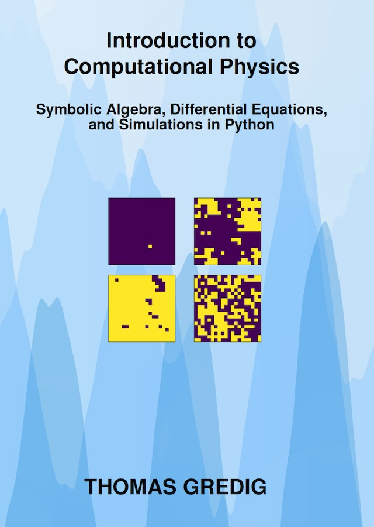

# PHYS 360 - Introduction to Computational Physics

> Author: Thomas Gredig

Book: Introduction to Computational Physics (**ISBN: 979-834609604-7**)




- [Data](data/) files for PHYS 360
- Report template for use with Quarto

## Report Template

Install [Quarto](https://quarto.org/docs/download/), then add the Quarto template from the command line / terminal:

```bash
quarto add thomasgredig/phys360
```

Then modify the YAML header in the quarto file (.qmd) to start with:

```yml
---
title: Final Project Report PHYS 360
author: Thomas Gredig
date: last-modified
format:
  phys360-html: default
  phys360-pdf: default
---
```
